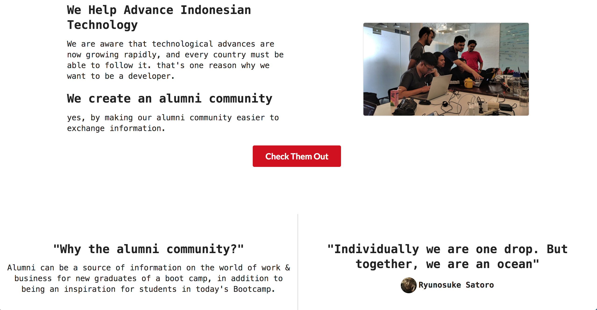
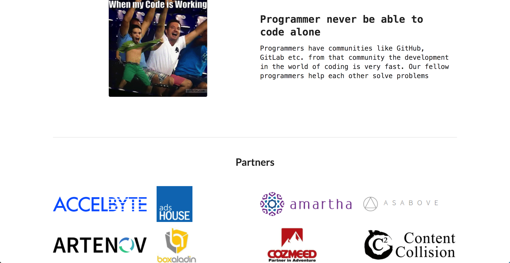

# Impact Alumni WEB







## Tech Stack

- [**React**](https://reactjs.org/) JavaScript library for building user interfaces
- [**Semantic UI React**](https://react.semantic-ui.com/) React javascript user interface library

## Installation and Configuration

1. Run: `npm install` to install the dependencies

## Running

### Development

1. Run: `npm run start` to run the app

### Production

1. Run: `npm run build` to build the app

## Tech Stack

- React.js
- React Router
- Netlify
- Uniregistry

## App Structure

### React: View

- `src`

  - `index.js`: configures the whole React + Router + Redux
  - `App.js`: sets the routes for `pages`
  - `styles`: all global styles
    - `*.css`
  - `templates`: wraps `pages` components
    - `*.js`: usually formatted as `Layout*`
  - `pages`: contains `large` components
    - `*.js`
  - `large`: contains `medium` components
    - `*.js`
  - `medium`: contains `small` components
    - `*.js`
  - `small`: contains primitive DOM components

    - `*.js`

---

## Development

### Installing

Install `yarn` with `npm`

```sh
npm install -g yarn
yarn install
```

Create `.env` file that contains:

```sh
REACT_APP_API_URL=http://localhost:3000
REACT_APP_JWT_SECRET=myjwtsecret
```

This `.env` can be changed in `production` as well.

### Running

```sh
npm start
```

Also run the [backend API](https://github.com/ImpactAlumni/impactalumni-backend)

```sh
npm start
```

### Building

```sh
npm build
```

---

## Deployment

### Application

`node` => `react` => `react-scripts` => `react-app-rewired`

### Infrastructure

GitHub => Netlify

### Deploying

```sh
npm deploy
```

---

## License

[MIT License](./LICENSE)
